过去一年，笔者先后把 Claude Code、Codex 和 Pi-Agent 放进了自己的日常开发流程。它们轮流成为主力，也逐渐变成并用。每次切换看起来只是换了一个客户端，实际上却是在重新选择：谁来掌握权限，谁来管理上下文，谁来编排模型和工具，哪些能力属于平台，哪些能力应该留在用户自己手里。

这篇文章不是一份 AI Coding 工具排行榜，也不是要证明某个产品永远更好。我希望通过自身的使用记录与几次真实迁移实践，和读者交流探讨，或许能提供一些参考。

故事要从我离开 Claude Code 开始。

## 离开ClaudeCode后，我才发现外边没雨

笔者在2025年7月开始使用Claude Code。在很长一段时间，我都默认 Claude Code 就是 AI 编码工具的最终答案，也经历了「它辅助我写代码——>它主写代码，我review ——> 全盘交给他，我只做最终把关(其实在摸鱼)」的过程。笔者曾分享过个人对claude code一些实用工具https://blog.dewu-inc.com/article/MjEwMjE，在这段"蜜月期"中，Claude Code就是我日常代码开发绝对的核心。

但重度依赖了CC很久，我也被CC的一些缺点折磨的神智不清：繁琐到打断思路的权限审批、低效且重复的子 Agent 探索、越堆越满的臃肿功能，一点点消耗着原本顺滑的体验。

因此，在体验了Codex了，我真正地意识到了其他AI Coding产品好像也不差。我们来看一张图，这是笔者 2026 年 4 月到 8 月的 AI 编码工具使用记录，橙线代表 Claude Code，蓝线代表 Codex，纵轴为每周消耗的 Token 量。整条曲线清晰地划分出三个阶段：

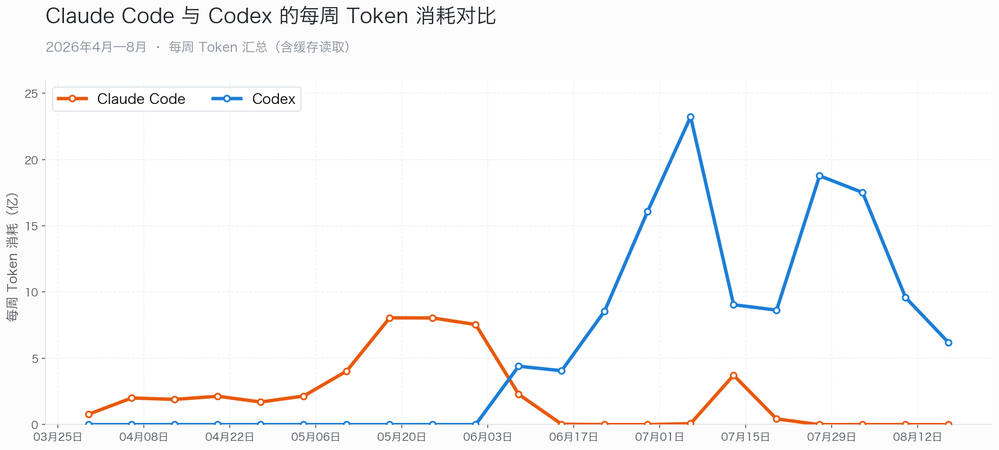

- 4 月到 5 月，Claude Code 一直是我的主力工具。图上的橙线从**1 亿一路涨到 8 亿 token**，我也从偶尔让它写点代码，变成把调试、重构和日常维护都交给它。实际上我也根本没用过Codex
-  **6 月第一周，蓝线出现，我开始使用Codex，很快就越过橙线；**再过一周，Claude Code 几乎归零，**Codex 正式接管了我的工作流**。整个切换只用了一周。
- **7 月是 Codex 使用量最高的时候**，单周一度超过 23 亿 token。中间那次 Claude Code 短暂回升，是我回去处理了一些旧任务，但很快又掉了下去。到了 8 月，蓝线也开始回落，因为 pi 加了进来，我的工具又从 Codex 单跑变成了 Codex 和 pi 并用。这个变化后面再讲。

 换到 Codex 之后，我消耗的 token 明显更多了：Claude Code 四个月一共用了 44.95 亿，Codex 三个月用了 126.10 亿——接近前者的 2.8 倍。

但 token 多不等于更贵：如果把缓存读取也算进去，笔者简单计算，得出Claude  Code 每百万 token 要 ¥1.33，Codex 只要 ¥0.56——**2.8 倍的 token，总费用只高了约 17%**。换个更直观的说法：**同样花一块钱，Codex 能跑的 token 大约是 Claude Code 的 2.4 倍。**

所以我离开 Claude Code，不是为了少用 token，也不是因为它不够聪明。真正有意思的问题是：一个我已经用顺手、而且用得很重的工具，为什么会在一周内被另一个工具替代？换完以后，我为什么反 而敢用更多 token？

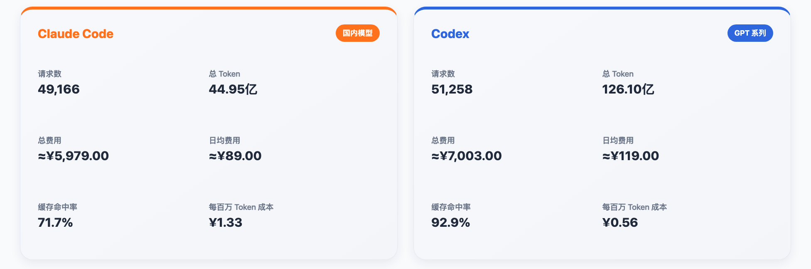

先给出一组我的真实使用数据：4 到 7 月间，我在 Claude Code 里发起了 49166 次请求，跑了 685 个会话，累计消耗 44.95 亿 Token。平均每个会话有 72 次交互，最长的单个会话连续跑了 719 次。我很少让它做批量代码生成，更多是带着它追根究底地排查问题 —— 从 GitLab 分支同步损坏的数据库记录，一路定位到 Java Chunker 语法树的递归崩溃。直到今天我依然认为，Claude Code 是最聪明的编码工具之一。

当公司提供了一笔codex额度时，我去openai官网下载了Codex应用，试用了一下，然后当天我就把日常开发工作搬迁到了Codex——这也正是6月橙线连线产生交点的时刻。我并没有觉得Codex比Claude Code聪明了多少，它只是精准地把我觉得不爽的几个地方改掉了：

- **打断太多：**之前用 CC，我需要时不时盯一下。每点一次"允许"都是一次打断；打断多了，我会自动不给它复杂任务，因为复杂任务意味着更多审批、更多返工、更多要盯的轮次。Codex 把这层撤掉后，我给它的任务粒度肉眼可见地变大了。
- **子Agent重复探索：**另外，CC 的贵，一半贵在浪费：子 Agent 重复探索、系统提示词 7k~10k、缓存命中只有 71.7%。
- 另外，Codex 桌面版把终端、多项目管理和内置浏览器集成在同一个应用里，相当于少开了一个 IDE。

这三处改动看似细碎，却每一下都精准卸掉了 Claude Code 套在我手上的枷锁：不用频繁打断思路点审批，不用为冗余消耗心疼成本，也不用在多个窗口间来回跳转。任务粒度直接放大，交互链路彻底打通 —— 这正是我一周内完成全量切换、并且敢放开手脚，跑了更多任务的直接答案。

但这还只是最表层的感受。真正沉下心用了一段时间我才意识到，Codex 和 Claude Code 的差距，从来不是 "谁更聪明"，而是两者对「AI 编码工具该扮演什么角色」的底层理解完全不同。

## Codex：半部论语可治天下？

我第一次用 Codex 的时候，当时心里就一句话：半部论语可治天下。

Claude Code 解决不了的问题，Codex 基本都解决了；我想要的定制能力，也可以通过 skill 和外部工具补上。那段时间我甚至觉得，AI Coding 的 harness 大概就应该是这个样子。

Codex 是跑在沙盒里，权限按工作区配置。在我一次性配置好后，工作区内的常规读写和命令**不再逐次询问**，这时的agent才像个拿到权限的同事：读文件、跑命令、改代码，一口气做完，最后汇报。在我使用codex的 335 个会话里，审批事件是 0 次。

这不是我一个人的感受。笔者从网上调研了一下：XDA 一篇"一周从 Claude Code 切到 Codex"的体验文，作者原本把 Claude Code 当作日常首选，后来发现 Codex 更适合交代任务、让它在沙盒里连续执行，自己回来验收。Karan Goyal 的迁移记录也写得很直接：不是 Codex 让 Claude Code 变差，而是 Codex 更贴合他一天里代码、文档、研究、图片和解释混在一起的真实工作流。代码质量接近到一定程度以后，决定胜负的就不再是某个函数谁写得更漂亮，而是谁让你少切几次工具、少重建几次上下文。

还有两个功能，我一开始并不知道。但后面接触并使用下来，觉得是非常好用的：

- **浏览器操作**，我可以直接让 Codex 进入浏览器帮我 debug：起一个本地服务，让它打开页面，看渲染结果，定位问题，修改代码，再刷新、再验证。代码和页面之间形成了一个很紧的循环。
- **Codex不怎么调subagent**，更倾向于把工作留在主 Agent 里完成。

  - 一开始我觉得这是个缺点。Claude Code 的子 Agent 用得多，看起来更"工程化"；Codex 从头到尾像只有一个主线程，甚至有点笨。但用久以后，我发现连续性本身就是效率：文件读取、工具输出和已经做过的决定，都留在同一个上下文里。至少在我那批会话里，我较少遇到"刚查过，又从头查一遍"的感觉。
  - 另外，**子agent最大的问题是过程不可见，**主 Agent 只收到一个摘要，用户又只看到主 Agent 的安排。Pi 作者 Mario Zechner 把这种结构叫作"黑箱里的黑箱"，Armin Ronacher 也写过类似的观察：在 Claude Code 里，编排 Agent 往往会把工作交给一个用户看不见的子 Agent。

Codex 火得很迅速：我身边的同事陆续开始换，网上测评几乎一边倒地夸，，npm 下载量在 5 月初就已经是 Claude Code 的 12 倍。所有人夸的点都高度一致：**免审批、沙盒顺滑、重上下文，真香**。但它有一个对国内用户近乎致命的硬伤：GPT 在海外。

笔者使用期间，经常碰到断连问题。一个任务跑着跑着就挂了。。。重连吧，会一直等着；不重连吧，上下文丢了，难受。而这个问题，在中文社区里并不罕见。有人记录过 Codex 启动时反复出现"Reconnecting 1/5……5/5"，总结为"不是失败，而是先失败几次，再成功"。国内后来出现的各种网关、协议转换和供应商切换工具，本质上也都在尝试保留 Codex 的工作流，替换它不稳定的模型连接。

此外，我也试过给 Codex 接国产模型。能用，但别扭。Codex 允许更换 provider，可"能接上"和"完整适配"不是一回事：协议转换、工具调用和桌面体验，总有一层不贴合。壳和芯并非完全拆不开，只是拆开以后，往往不再是原来那套体验。

但这只是问题的一半。另一半，是它自己也在变重。桌面端从浏览器、@Chrome、@Computer、Automations、Goals 一路加下来，功能越来越全，也越来越像一个全家桶。功能多不是坏事，但当一个工具开始什么都往里装时，我开始感觉它不再只是 harness，而更像一个平台。

平台没有不好。只是平台会有自己的产品意志：它替你决定哪些能力应该进入核心，哪些工作应该怎样被编排，哪些功能应该继续加进来。Codex 最初让我觉得"终于有人把 harness 做对了"，后来却让我开始问另一个问题：如果我不想要其中一部分呢？如果我想换模型、换循环、换交互，或者只保留最小的那几件事呢？

这时我才意识到，自己寻找的已经不是"比 Codex 更强的 Codex"，而是另一种取舍：核心尽可能小，能力按需安装，模型可以替换，工具的边界由使用者决定。沿着这个问题找下去，我遇到了 pi：一个系统提示词很短、默认只有四个工具的终端 Agent。没有桌面端，没有内置浏览器，没有沙盒，却把几乎所有扩展空间留给了使用者。

## Pi-Agent：毛坯房装修记

### **被 CC 逼疯的人**

Pi 的创始人 Mario Zechner，正是知名跨平台游戏引擎 libGDX 的作者。2025 年，他长期重度使用 Claude Code，却不断被频繁迭代、不可控的产品改动打乱开发节奏，索性动手从零写了一款极简的编程 Agent。如果你也曾厌烦 Claude Code 的臃肿，想寻找一款轻量化 harness，Mario 的博客完整记录下了他开发 Pi 的心路历程，几乎和我一路切换工具的心路完全重合。

> Claude Code 已经变成了一艘飞船，但里面 80% 的功能我用不上。

Mario 说，每次发版，ClaudeCode系统提示词和工具都在变，破坏他的工作流，改变模型行为。他讨厌这个。他甚至专门搭了个网站（cchistory）去追踪 Claude Code 每次发版系统提示词和工具怎么变。他吐槽的点，几乎每一条都踩在我自己踩过的坑上：

- CC 的权限审批烦，他说那套安全措施"mostly security theater"（多半是安全剧场），所以 pi 干脆不做权限弹窗；
- CC 的系统提示词动辄 7k~10k token，他直言"there does not appear to be a need for 10,000 tokens of system prompt"，于是 pi 把整套提示词压到 1000 token 以下；
- CC 的子 agent 频繁重复探索，他则批评那是"a black box within a black box"（黑箱中的黑箱）——主 Agent 看不到子 Agent 的过程，用户又看不到主 Agent 如何编排子 Agent，中间还要转手上下文，不如让主 Agent 自己主导。

而 Mario 最终交出的这款 harness，就是 Pi‑Agent。它的产品哲学可以用一句话概括：如果我不需要，它就不会被造出来。

这句话听上去带着几分极客式的任性，但放在 coding agent 领域，反而是一种非常务实的克制。Pi 的系统提示词被压到极短，连同工具定义在内不到 1000 token，核心正文仅约 200 token；默认内置的工具也只有四个：read、write、edit 和 bash。

| 功能 | Claude Code | Codex | Pi |
|-|-|-|-|
| MCP 支持 | ✅ 原生 | ✅ 原生 | ❌ 没有 |
| Plan Mode | ✅ 有 | ✅ 有 | ❌ 没有 |
| 子 Agent | ✅ 有 | ✅ 有 | ❌ 没有 |
| 权限弹窗 | ✅ 有 | ✅ 有 | ❌ 没有 |
| 内置待办 | ✅ 有 | ✅ 有 | ❌ 没有 |

此外，我们看上面的表格，很多harness把所有功能预装上了，但说实话很多功能并不是我需要的。比如MCP，笔者从来没有使用过，不装；子agent，这个我还是要的，通过pi的插件装备上了这个功能。xxxxxx

这正是 Pi 和 Claude Code、Codex **最核心的思路差异**。后两者走的是成品产品路线：尽可能把主流场景的能力提前做好，用户开箱即用。而 Pi 只提供最基础的能力原语，剩下的所有高阶功能，都交由模型、终端和用户自己组合扩展。

另外，Mario 甚至认为 coding agent **不需要冗长的系统提示词**。他的判断是：当下的前沿大模型已经经过了充分训练，天然就知道编码 Agent 该如何工作，根本不需要上万 token 的说明书来手把手约束。只要给它们开放 read/write/edit/bash 四个基础工具，模型自己就知道该怎么推进任务。工具越少，token 开销越低，模型需要推理的动作空间越小，执行效率反而越高。

### Pi 真的好用吗

不过，极简的设计哲学终究要落地到真实干活的能力上。道理讲得再通透，最终还是要回答一个核心问题：**Pi 真的好用吗？笔者**找了两组第三方公开评测数据，再结合自己的实际使用感受，从不同维度来拆解这个问题。

第一组来自智能体工具集成平台 Composio。他们统一使用 DeepSeek-V4-Pro 作为底层模型，让 Claude Code、Pi、OpenCode、Hermes、DeepSeek Harness 五款工具分别完成 30 个真实多应用集成任务，覆盖 Gmail、Google Sheets、GitHub、Slack 等平台，单题限时 900 秒。

结果显示：**Pi 通过了 21 题，排名第一；**DeepSeek Harness 通过 20 题，排名第二；Claude Code 和 OpenCode 各通过 19 题；Hermes 通过 18 题。但如果把成本和速度也算进去：Pi 的通过率最高，DeepSeek Harness 的成本最低，每个成功任务平均只花 0.028 美元；Claude Code 的速度最快，单题中位耗时约 182 秒，不过成本也是一柱擎天的高。

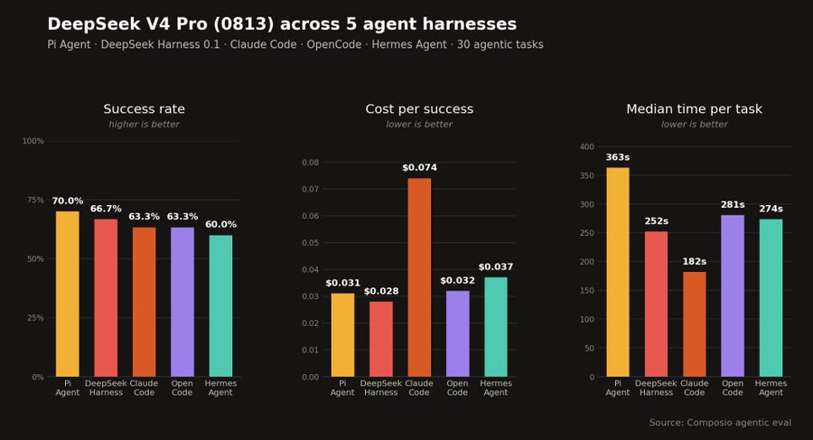

这组数据说明，Pi 并不是靠堆功能取胜。它的系统提示词很短，默认工具也很少，但在复杂的真实任务中，反而拿到了最高的通过率。当然，Pi的时间更多，这是因为Pi只有四个工具，一些复杂操作需要写脚本实现，这花了一些时间。

而且，这并不是一次偶然的结果。Composio 已经进行了三轮 Agent Harness 横评：前两次分别使用 DeepSeek-V4-Flash 和 Kimi K3，评测对象也从 6 个扩展到 8 个 Agent。在使用 DeepSeek-V4-Flash 的那一轮中，Pi 通过了 20/30；这次换成 DeepSeek-V4-Pro，Pi 仍然以 21/30 排名第一。

第二组数据来自 Databricks，**提供了另一个更贴近工业级开发的视角**。作为数据与 AI 基础设施厂商，他们在自家数百万行规模的代码库上，用真实工程任务评测了不同模型与 Agent 组合的表现。

评测的横轴是单任务平均成本，纵轴是总体通过率。大家可以重点看**红色虚线**，它代表成本与效果之间的最优平衡线，也就是成本-效果前沿，**Pi 多次出现在这条线上**：GLM 5.2 搭配 Pi，单题成本约 1.27 美元，通过率达到 87%；Opus 4.8 搭配 Pi，并把推理强度开到 xhigh，通过率达到 90%。

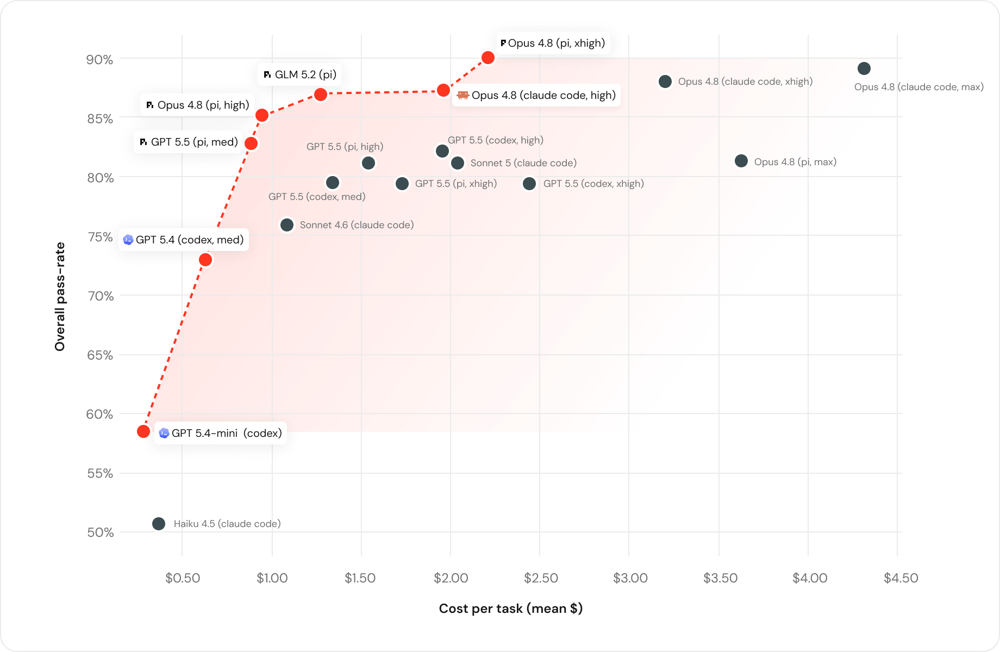

同一个模型放进不同 harness，差距也很明显。Opus 4.8 搭配 Pi（high）时，成本约 0.95 美元，通过率约 85%；搭配 Claude Code（high）时，成本接近 1.96 美元，通过率约 87%。成本翻了一倍，效果却只提升了几个百分点。

所以，Pi 的优势并不是"工具更多"，恰恰相反，它把工具、提示词和中间层都压缩到了最低限度，让模型直接面对任务。**Databricks 的结论也很明确**：模型只是影响结果的一部分，harness 如何管理上下文、组织工具和控制执行流程，同样会显著影响最终表现。

当然，这两组测试的任务、模型和评价标准都不一样，不能简单理解成"Pi 永远最好"。但它们至少共同指向了一个结论：**Coding Agent 的竞争，已经不只是模型之争，也是 harness 之争。**对那些觉得 Claude Code 太重、太复杂、变化太快的人来说，Pi 至少证明了一件事：一套足够简单的 Agent，确实可以在真实任务里做到又快又省，而且不一定更弱。

我的个人体验也与此吻合。在7 月份国产模型能力追上国外模型后，我开始高强度使用 Pi，发现它基本复刻了 CC 80% 的常用功能——cli 命令差不多，交互逻辑也相似，迁移几乎没有成本。但不需要审批是真的爽。

而且从我的体感中，我感觉到同一个模型，**放在 Pi 里的表现往往比在 Claude Code 里更好**，我倾向于认为这和注意力分配有关 —— 当系统提示词里没有上万字的预设指令抢占模型注意力，面对同一项日常任务时，模型的判断会更聚焦、执行也更精准。

有趣的是，Claude Code 也朝同一个方向移动了。2026 年 7 月，Anthropic 宣布大幅减少 Claude Code 的系统提示词，并称内部评测没有观察到可测量的性能下降。它给出的解释与Pi-Agent 的判断很接近：过去为旧模型写下的许多微观约束，在更强的模型上可能反而变成噪音。

这让我重新理解了 Pi 的极简：它不一定代表"功能越少越先进"，但它提前押注了一个方向——模型已经足够强，harness 不必替它规定每一个动作。把规则、工具和交互留在核心之外，用户才有机会决定哪些能力值得装进自己的工作流。而 pi 恰好把「装」这件事本身，也开放了出来。

### 打造个人的harness

一个默认只有四件工具的 Agent，就像一间毛坯房，想要什么就自己装什么——装 subagent 插件、装 plan mode、装 MCP adapter，甚至改主题、换 TUI；装不了的就自己写。**Pi 的扩展体系是开放的**：一个 TypeScript 文件扔进 ~/.pi/agent/extensions/，就能拦截会话生命周期、spawn 子进程、调外部 CLI，全程不碰 pi 本体。我第一次启动 pi 时，第一反应不是「这也太简陋了」，而是「这东西居然真的能工作」。它能读文件、改代码、跑命令，模型可以自己切换，skill 也可以按需加载。最让我意外的不是它缺什么，而是扩展不是配置文件里几个开关，而是真正可以写代码的 TypeScript 模块。这给了我一个很具体的感觉：我不需要等待作者把某个功能加入 roadmap，也不需要接受产品规定好的交互方式。觉得行为不对，就写个扩展接进 session 生命周期；觉得工具缺失，就自己注册；觉得界面不顺手，就自己改。当然，这种自由是有代价的。pi 没有 Codex 的桌面端，没有内置浏览器，也没有沙盒；它默认给了 Agent 很大的权限，安全边界要自己负责；开箱即用的体验也不如 Claude Code 和 Codex，很多能力要靠扩展、skill 或外部工具补上。但这正是我当时想要的东西：不是另一个替我做完所有决定的平台，而是一套可以逐步改造成自己工作流的基础设施。下面，就是我的装修过程。

#### 装修记1：搬运skills

在终端执行下面的命令就可以快速使用Pi-Agent了，读者也可以阅读https://pi.dev/获取使用文档或者查看插件市场。

```Plain Text
curl -fsSL https://pi.dev/install.sh | sh
```

当我们获取了Pi-Agent，第一步是做什么呢？从CC、Codex迁移过来，是否麻烦？

实际上，从Claude Code迁移到Codex的时候，我就发现 日常开发工作流，最重要的资产就是 项目agent文档(CLAUDE.md/AGENTS.md) 和Skills了，迁移成本真的没有想象的那么高。

我们只需要把CLAUDE.md改成AGENTS.md(除cc之外的AI Coding产品通用)，将个人和项目Skill迁移一下即可。这个过程并没有太多代价。Harness是可以换的，没必要一直依赖一个，半部论语真不够。

此外，之前我已经写了一批项目开发相关的 skill：CI 故障排查、Issue 开发闭环、严格代码审查、插件开发、数据库分析以及我自己的研究和发布流程。这些东西其实不属于 Codex。它们是我对问题的理解、对项目的术语、对验证步骤的约定，只是暂时放在某个工具的目录里。我把这批 skill 放进 pi 之后，换掉的只是运行它们的 harness，里面沉淀下来的经验还在。

#### 装修记2：预装一些社区插件

事实上，原始的Pi还是太极简了，搬运skills更像是一些私人行李，当我们想入住时，还是需要置办一些家具的。所以，我们需要预装一些Pi社区的插件(完全免费、开源)。

例如当我使用非视觉模型，希望有个调用视觉模型的工具帮我处理图片，最后Pi经过本地验证和三方比价，给我推荐了最适合我的插件。而我在这个过程中，只提出了自己的需求+验收结果。初始时，笔者也没有装太多插件，在使用过程中，逐渐意识到自己需要什么插件的时候，才会去装一下。当我有需求时，我一般起一个Pi进程去帮我找一下。下面是笔者的一些个人经历。

| 需要调用视觉模型的工具帮我处理图片 | 使用过程中，我觉得Pi的UI太简陋了，使用了社区的UI加强插件。 | 我需要subagent能力，装了subagent插件 | 我使用cmux终端，装了pi-cmux插件，用于进行一些终端操作和消息提醒 |
|-|-|-|-|
| 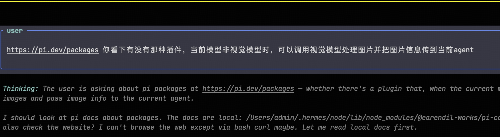 | 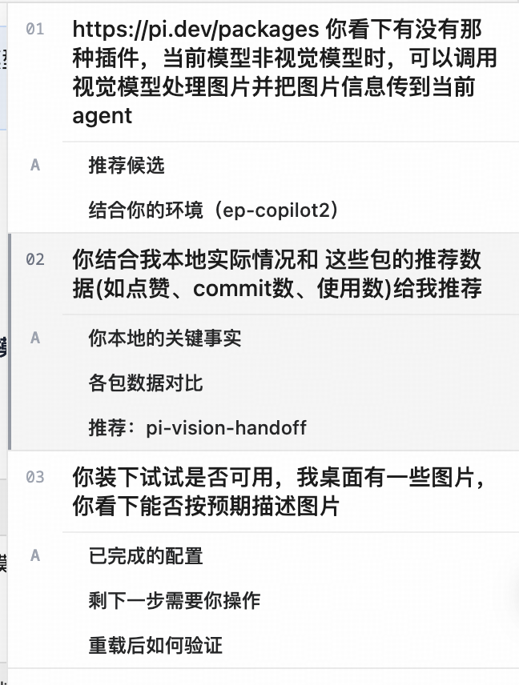 | 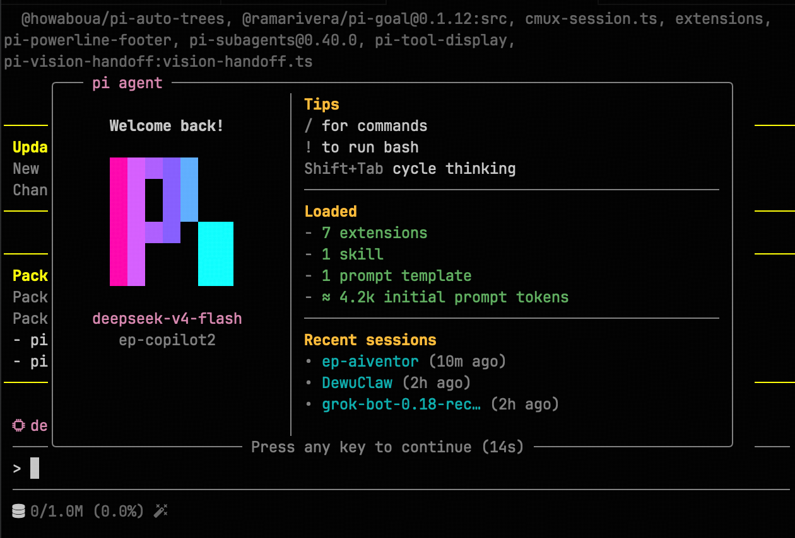 | 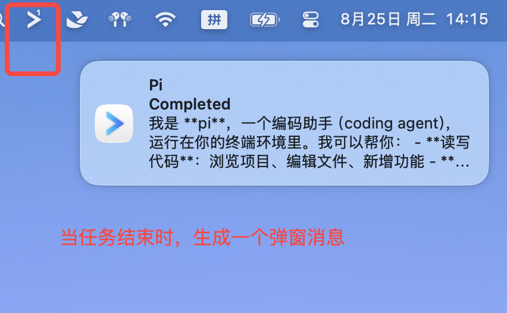 |

> 表格中第3列图片（img15）实际对应 subagent 执行输出界面，见下方补图。

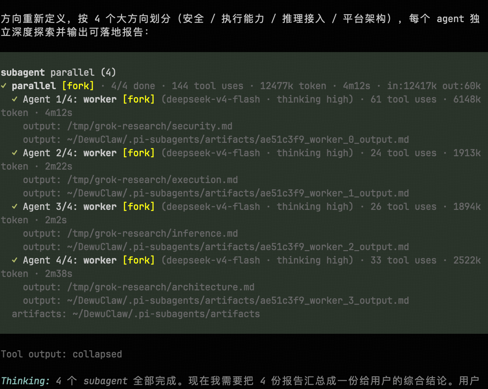

读者如果希望使用Pi-Agent，这是笔者推荐的一些插件，读者只需要执行相应的命令进行安装，或者直接让pi帮你安装。

| 名称 | 一句话说明 | 安装方式 |
|-|-|-|
| @ff-labs/pi-fff | 用 Rust 原生、SIMD 加速的 FFF 模糊搜索替换内置 find/grep 工具 | `pi install npm:@ff-labs/pi-fff` |
| @narumitw/pi-btw | 新增 /btw 旁路提问命令，在临时侧线程快速答疑，不污染主对话 | `pi install npm:@narumitw/pi-btw` |
| Dovyski/pi-recap | 每次交互结束后在状态栏显示斜体小结，并更新终端标签页标题 | `pi install git:https://github.com/Dovyski/pi-recap` |
| pi-powerline-footer | Powerline 风格状态栏，带欢迎浮层和 AI 生成的加载提示语 | `pi install npm:pi-powerline-footer` |
| pi-subagents | subagents 的 Pi 实现，可以用 Herdr/Tmux 代替 | `pi install npm:pi-subagents` |
| pi-tool-display | 紧凑渲染工具调用、diff 可视化与输出截断，让 TUI 更清爽 | `pi install npm:pi-tool-display` |
| pi-web-access | 网页搜索、URL 抓取、GitHub 克隆、PDF 提取 | `pi install npm:pi-web-access` |
| @ogulcancelik/pi-herdr | 通过 Pi 控制 Herdr，代替 subagents | `pi install npm:@ogulcancelik/pi-herdr` |

#### 装修记3：自己开发修改插件

虽然社区插件很强大，但是不一定能满足个人需要，笔者也进行了一些「私人订制」。我用的终端是 Cmux，每个 Pi 会话的 tab 都叫「pi-文件夹名」，导致一堆 tab 长得一模一样。

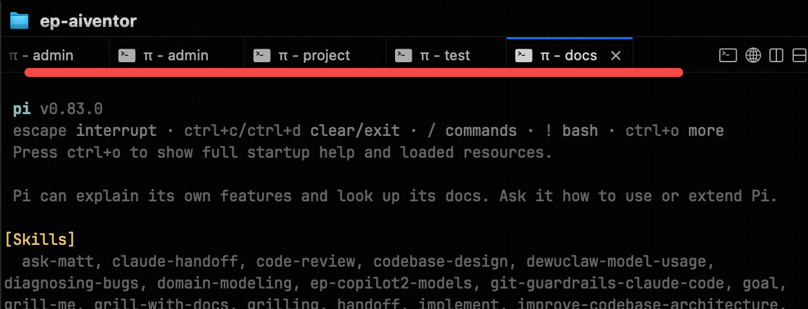

Cmux官方为Claude Code做了适配，自动显示当前正在干什么。Cmux 虽然有官方的 Pi 集成，但只处理它自己创建的分屏，不处理标题。所以，我把自己的想法跟Pi说了一下，看是否能修改Pi-Cmux插件。最初我让 Pi 写了个简单扩展，结果它只能显示模型和文件夹，根本没有回答"现在在做什么"。我把几个真实会话和约束交给 Pi，让它重新设计：用无头 Pi 总结当前对话，再只修改对应的 tab 名。

后面的实现基本都是 Pi 自己完成的，我负责提供方向、样例和验收标准。过程中只短暂踩了两个坑：无头子进程加载同一个扩展，触发了递归；管道没有及时收到 EOF，标题生成一直等到超时。问题修掉后，这个本地扩展就能稳定工作了。我又把它按 pi-cmux 的代码风格重写，补上配置、README 和 CHANGELOG，做成默认关闭的 opt-in，最后提了一个上游 PR。一个"tab 标题不好看"的小需求，最后变成了从需求描述、实现、调试到开源协作的一整套流程；而 Pi 把这套流程的门槛，降到了我只需要说清楚想要什么。

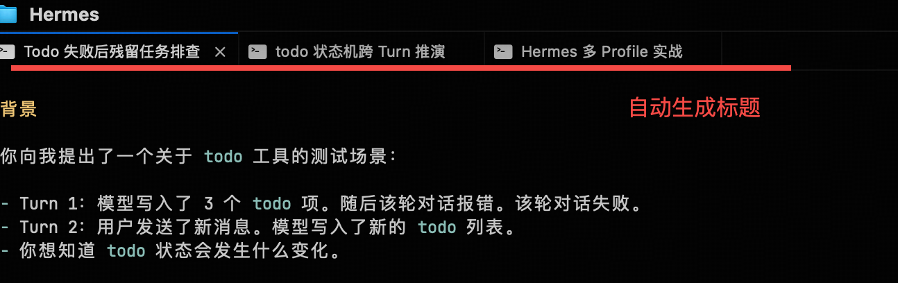

#### 装修记End：拎包入住

完成了Pi的装修后，当前我的Pi也有一些CC、Codex**做不到的能力！**

##### 视觉桥

我们刚才说，通过插件为 Pi 增加了"视觉桥"能力：当当前会话使用的是不具备视觉能力的模型时，Pi 可以把图片转交给专门的多模态模型处理，再将识别结果返回给主会话。

这其实解决了一个实际问题：在国产模型中，代码能力最强的模型往往不一定具备多模态能力；而具备图片理解能力的模型，编码和复杂推理能力又可能不是最强。在 CC 或 Codex 中，这个问题通常不明显，因为 Claude 或 GPT 系列模型往往同时具备较强的编码和视觉能力。但当你希望在这些产品中使用国产模型时，就可能遇到"**代码能力和视觉能力无法同时满足**"的取舍：要么使用更强的编码模型，却无法直接理解图片；要么切换到视觉模型，却牺牲代码质量。

那么当我用Pi时，主模型负责代码理解、架构设计和实现；视觉模型负责读取截图、分析界面、识别图表或理解图片内容；插件负责在两者之间传递上下文和结果。这样，同一个会话中可以继续使用编码能力最强的模型，同时按需调用视觉模型处理图片。不需要为了看一张截图，放弃当前正在使用的代码模型，也不需要手动复制和转述图片内容。

##### 多模型交叉审查：用不同视角增加缺陷覆盖面

笔者个人很喜欢**不同模型交叉审查代码**。CC 或 Codex 通常围绕各自平台提供的模型家族组织体验。模型质量很高，但模型选择、供应商切换和多模型并行编排，往往受到产品边界限制。尤其是在国产模型之间切换时，流程并不总是足够灵活。

当我使用Pi时， 则更像一个可编排的模型工作台。我可以在同一个代码Review任务中，分别调用不同国产模型去独立检查同一份代码变更。最后再由主 Agent 聚合报告、去重问题，并按照严重度和证据强度排序。

有很多读者可能质疑，这样真的有价值吗？事实上，这样只会额外花费一点token，但如果挖掘出一个bug或漏洞，那就是挖到金矿了。

其实，这样做的价值不是简单地把同一个问题问三遍，也不是认为"多数票一定正确"。真正的价值在于：**不同模型厂商的训练数据和训练方式是不同的。**因此，模型学会的推理习惯、工具使用方式和错误模式也不同。只要这些错误不是完全相关的，一个模型遗漏的问题，就可能被另一个模型发现。

我最近的一次实际审查就是这样完成的：让 DeepSeek Flash、DeepSeek Pro 和 GLM 分别独立审查同一个分支，再由主 Agent 聚合结果。三方共同发现了 Cron 卡片模型后缀失效、重复实现已有 helper 等问题；其中两个模型还独立发现了 `updated_at` 默认值导致的 Pydantic 序列化回归，并通过真实链路复现了问题。

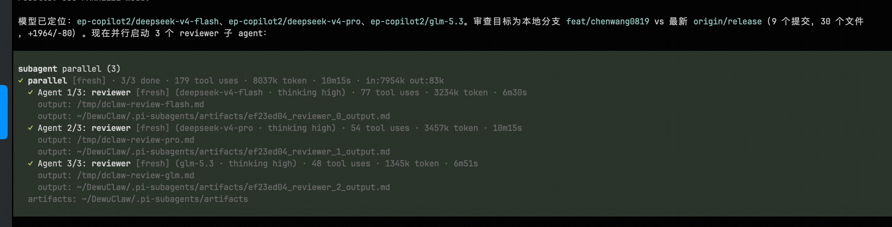

这类问题未必会在单次审查中出现。多模型交叉审查多消耗了一些 token 和调用成本，但如果因此提前发现一个生产环境才会暴露的 bug，成本通常是值得的。当然，多模型并不意味着模型越多越好。不同模型也可能共享相同的盲点，三票一致仍然可能是错的。因此，交叉审查应该配合固定的基线、结构化的审查报告、最小复现、针对性测试和人工仲裁。投票适合用来排序和升级问题，不能代替证据。

在 Pi 中，我可以自由调用国产模型、海外模型、本地模型或专门的视觉模型，并把它们组合成一个审查流程。模型不再只是一个需要手动切换的下拉选项，而是工作流中的不同角色：这也是 Pi 和传统单模型 Agent 之间一个重要的区别：它不要求所有能力集中在同一个模型里，而是允许不同模型在同一个会话和工作流中协作。

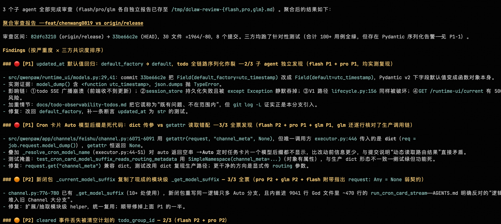

上文中，笔者发过一张 Claude Code 和 Codex 的 Token 使用图，当时 Pi 还没有加入。现在时间来到 8 月下旬，我们再来看一张最新的使用记录。

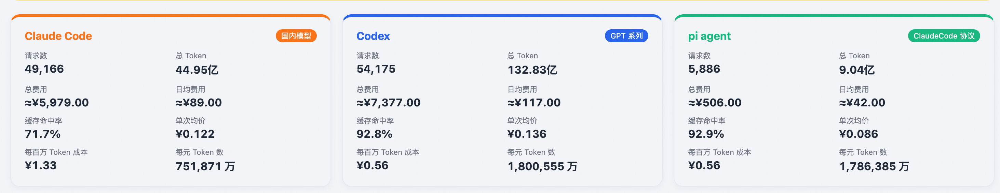

这一次，图里出现了三组数据。Claude Code 仍然是过去几个月的历史基线；Codex 从 6 月开始持续增长，累计 Token 消耗已经超过 130 亿；而 Pi 是 8 月 11 日才加入的，观察时间不到半个月，但很快就从一条几乎贴着零轴的绿线，变成了**日常工作流中的另一条主线**。

这里不能简单比较三者的总量，因为它们的使用周期并不相同。真正值得看的，是 Pi 的增长速度，以及它和 Codex 几乎相同的成本效率：**两者每百万 Token 的成本都约为 ¥0.56，缓存命中率也都接近 93%**。从日度曲线看，8 月 18 日之后，Pi 的使用量开始多次超过 Codex；8 月 21 日和 22 日，Pi 的单日费用甚至已经高于 Codex。它不再只是我拿来尝鲜的备用工具，而是在实际承接任务。

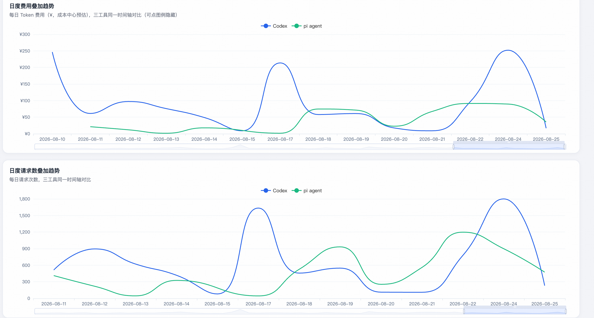

笔者并没有让 Pi 替代了 Codex，而是我的工作流开始从"押注一个工具"变成了"**多个 harness 并用**"：Codex 一些浏览器操作我还是无法割舍，但Pi 则让我可以更自由地切换模型、补充插件，并把一些原本属于产品内部的能力拆出来自己组合。Token 总量没有因为换工具而下降，反而继续增加了，因为当我合理的驾驭多匹马时，我解决问题的效率又提高了。

#### Pi-Agent与harness自进化

其实，在这个过程，笔者也完成了一次很小的 **harness 自进化**：不是模型变聪明了，而是我根据真实使用中的问题，让 Agent 帮我把工具本身改了一遍。它写出了标题插件，修掉了递归和超时，又把补丁提回了上游。下一次遇到类似问题，我不需要再从头解释，工具已经把这次经验留下来了。

这里的"自进化"不是科幻意义上的 AI 自己改写模型参数。Lilian Weng 在 [Harness Engineering for Self-Improvement](https://lilianweng.github.io/posts/2026-07-04-harness/) 里把 harness 描述成模型周围那层负责工具、上下文、记忆、工作流和评估的系统，并总结了一条很清楚的路线：优化对象会从 instruction，走到 structured context、workflow、harness code，最后甚至走到优化 harness 的代码。真正有价值的改进，往往不是再写一条更长的提示词，而是让这套系统能从执行记录里发现问题，提出修改，再用测试和评估决定要不要留下。

为什么需要这层自进化？因为模型能力只是一部分。任务变长了，上下文会失控；工具变多了，编排会变重；模型换了，原来的提示词和工作流可能又不合适。**固定产品只能替所有人做一套平均选择**，而每个项目、每个团队、每个用户真正需要的东西都不一样。能让 harness 根据失败记录不断变好，才有机会把一次性的 workaround 变成长期可复用的能力。

## Deepseek-Harness：自进化与未来

Deepseek-Harness 是 DeepSeek 在 2026 年 8 月 14 日开源的一个 agent harness，MIT 协议。它发布当天就炸了——几小时内 GitHub 冲到 3 万多 star，成了 GitHub 史上 star 增速最快的开源项目，到现在已经 15 万+。

Pi 的设计者思路很直接：能让用户自己改的，就不要替用户做死。工具、skill、界面，甚至会话行为，都可以通过扩展调整。DeepSeek Harness（DSH）则把这件事推到了更极端：模型、工具、会话、存储、沙箱、调度、UI，连**决定 Agent 如何思考和循环执行的 agent loop，都可以替换**。它的设计理念只有一句话：**Everything is a Plugin**。而且它是开源的，插件不再只是产品团队预装好的功能，社区也可以继续往里面添东西。

把这套思路搬到 Agent 上，意义就很清楚了：会话、上下文、工具调用和任务状态，都可以沉淀成一套通用底座；恢复、分叉、检索和回放，不必每个团队重复实现；文件系统、沙箱、子 Agent，甚至整套执行循环，也可以在接口不变的情况下替换。这样做医疗、法律或工业场景的 Agent，就不必每次都从零搭一套骨架。

但 "Everything is a Plugin" 真正改变的，不是功能清单，而是决定权的归属。平台可以提供一套默认组合，却不应该把默认组合伪装成唯一答案。模型、工具、上下文、会话和执行循环都能够替换，用户才有机会把一次性的 workaround 变成自己的基础设施。今天可以通过插件补一个视觉模型，明天也可以换掉整个 agent loop。重要的不是每一次都选对，而是选错之后仍然改得动、迁得走。

回头看，我从 Claude Code 到 Codex，再到 Pi，表面上是在换工具，实际上是在把工作流从产品里一点点搬回自己手里。真正留下来的，不是某个应用的快捷键，而是 `AGENTS.md`、skills、插件、评估标准，以及那些被失败逼出来的经验。模型会换代，平台会变重，网络也会时好时坏，但这些东西可以跟着我走。

所以，我的标题"在雨后醒来"并不是说外面的工具都完美，而是说我终于发现，Claude Code、Codex、Pi 和 DeepSeek Harness 都只是不同的房子。没有哪一间值得终身押注；更重要的是，我已经学会了怎么带着自己的家具，甚至自己搭墙。下一次再换工具时，我不必重新开始。
